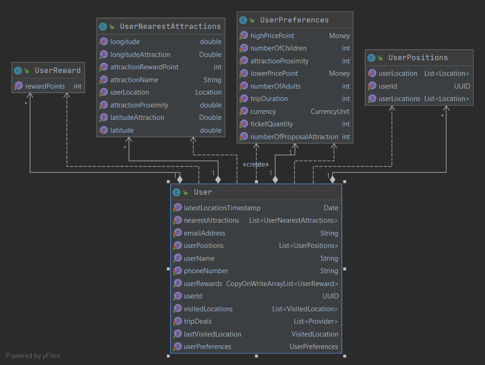

#TourGuide App
TourGuide is a travel app made for all.

## purpose
You can get : 
- Users and their positions
- All users locations
- Add user's preferences
- User's trip deals
- nearby attractions

## Model


## Prerequisite to run

- Java 1.8
- Gradle 6.6.1
- Docker

## Run app (localhost:8080)

Spring Boot
~~~
mvn spring-boot:run (run app)
mvn spring-boot:stop (stop app)
~~~~

Gradle
```
gradle bootRun
```
 ## Documentation
 DoDocumentation Postman [here](https://documenter.getpostman.com/view/10925968/TVYDdedS)
   
    